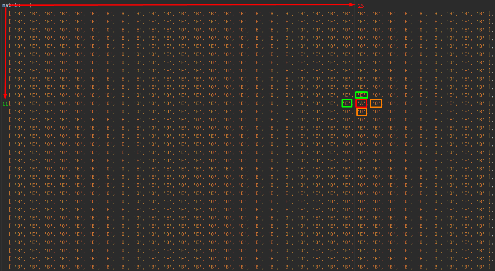

## Задание
- Написать функцию <b>move</b>, которая принимает двумерный массив: игровую локацию, координаты игрока и направление движения. Персонаж может двигаться только вверх, вниз, влево и вправо. Необходимо определить количество клеток, сколько клеток ('E') персонаж может пройти в заданном направлении, пока не столкнётся с препятствием ('O') или с границей ('B').
- Функция принимает:
  - location: массив массивов, заполненных обозначениями
    - 'B': 'Border', граница игровой карты. Движение запрещено.
    - 'O': 'Obstacle', препятствие. Движение запрещено.
    - 'E': 'Empty', пустая клетка. Движение разрешено.
    - 'A': 'Actor', пустая клетка на которой стоит персонаж сейчас.
  - actorCoordinates: Объект в виде: { x: number, y: number }, координаты игрока.
  - direction: строка, направление движения. Возможные значения: 'left', 'right', 'up', 'down'.
- Если можно пройти хоть один шаг, необходимо вернуть строку: "We can make <b>n</b steps and will stop because of "
  - 'obstacle', если натолкнулись на препятствие ('O').
  - 'border', если натолкнулись на границу карты ('B').
- Если персонаж сразу упирается в препятствие или границу по заданному направлению, верните: "We can't move because of "
  - 'obstacle', если натолкнулись на препятствие ('O').
  - 'border', если натолкнулись на границу карты ('B').

## Примечание
- Количество внутренних массивов и элементов в них - динамическое.

## Примеры
- 
- 
- (location, {x: 23, y: 11}, 'right') => 'We can't move because of obstacle' // вправо нельзя, т.к справа препятствие ('O').
- (location, {x: 23, y: 11}, 'left') => 'We can make 2 steps and will stop because of obstacle' // влево можем пройти 2 шага, упрёмся в препятствие.
- (location, {x: 23, y: 11}, 'up') => 'We can make 6 steps and will stop because of obstacle' // вверх можем пройти 6 шагов и упрёмся в препятствие.
- (location, {x: 23, y: 11}, 'down') => 'We can't move because of obstacle' // вниз нельзя